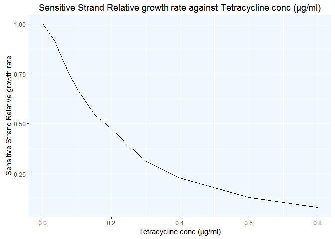
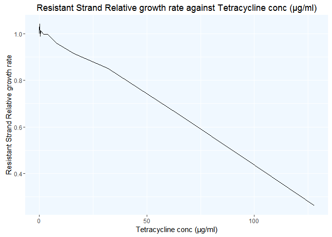
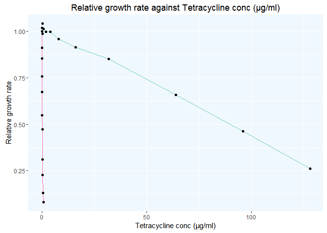
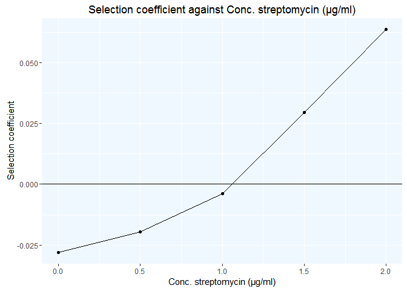
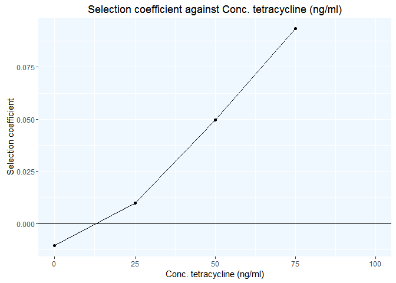

The graph below shows Relative exponential growth rates of susceptible
strain of S. typhimurium as a function of tetracycline concentration.
Cells were grown in Mueller Hinton medium at 37uC.

<!-- -->

The graph below shows Relative exponential growth rates of resistant
strain of S. typhimurium as a function of tetracycline concentration.
Cells were grown in Mueller Hinton medium at 37uC.

<!-- -->

This is Figure 1B graph as seen in the paper. The graph below shows the
above two graphs combined together. It shows the Relative exponential
growth rates of susceptible (pink line) and resistant (green line)
strains of S. typhimurium as a function of tetracycline concentration.
Cells were grown in Mueller Hinton medium at 37uC.

<!-- -->

Graph from Figure 2B of the paper which shows the Selection coefficients
streptomycin rpsL105(K42R) vs wild type. It intercepts the X axis at MSC
= 1/4 MIC.

<!-- -->

Graph from Figure 2D of the paper which shows the Selection coefficients
tetracycline cobA367::Tn10dtet vs wild type. It intercepts the X axis at
MSC = 1/100 MIC.

<!-- -->
